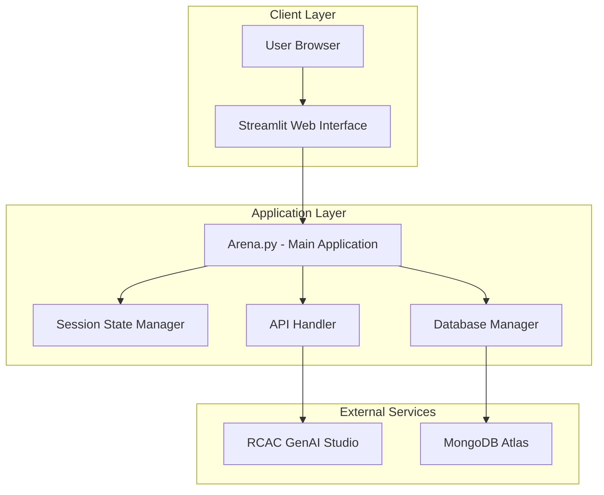
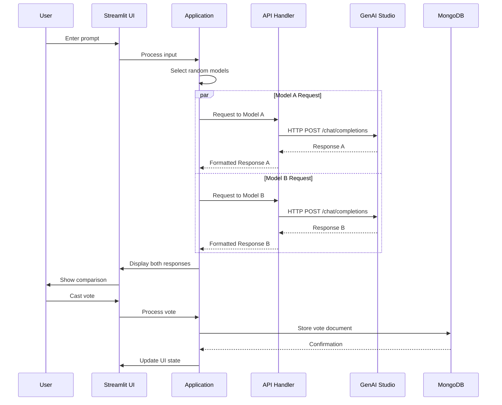

# 🏗️ Architecture Documentation

## 🔍 System Overview

ComplexFlow-Arena is an interactive web application that enables blind evaluation and comparison of responses from different Large Language Models (LLMs). The system provides an unbiased platform for users to evaluate model performance across various prompts and use cases.

### Key Features

- **Blind Evaluation**: Users see responses without knowing which model generated them
- **Multi-Model Support**: Integration with 8+ specialized LLMs
- **Real-time Comparison**: Side-by-side response display
- **Vote Tracking**: Persistent storage of user preferences
- **Rate Limit Management**: Intelligent handling of API constraints

## 🏗️ System Architecture

### High-Level Architecture Diagram



### Core Components

#### 1. Frontend Layer

- **Technology**: Streamlit 1.28+
- **Responsibilities**:
  - User interface rendering
  - Input validation and sanitization
  - Response display and formatting
  - Vote collection interface
  - Real-time status updates

#### 2. Application Layer

- **Main Controller**: `Arena.py`
- **Session Management**: Streamlit session state
- **API Integration**: HTTP client for model APIs
- **Database Operations**: MongoDB document management

#### 3. External Services

- **Model API**: Purdue RCAC GenAI Studio
- **Database**: MongoDB Atlas (Cloud)
- **Authentication**: Bearer token authentication

### Detailed Data Flow



## 🔧 Technical Implementation

### Model Pool Architecture

```python
# Model configuration with metadata
AVAILABLE_MODELS = {
    "codellama:latest": {
        "name": "CodeLlama",
        "specialization": "Code generation",
        "context_length": 16384,
        "provider": "Meta",
        "category": "code"
    },
    "deepseek-r1:14b": {
        "name": "DeepSeek R1",
        "specialization": "Reasoning",
        "context_length": 32768,
        "provider": "DeepSeek",
        "category": "reasoning"
    },
    "gemma3:12b": {
        "name": "Gemma 3",
        "specialization": "General purpose",
        "context_length": 8192,
        "provider": "Google",
        "category": "general"
    },
    "llama3.1:70b-instruct-q4_K_M": {
        "name": "Llama 3.1 70B",
        "specialization": "Instruction following",
        "context_length": 131072,
        "provider": "Meta",
        "category": "instruction"
    },
    "llava:latest": {
        "name": "LLaVA",
        "specialization": "Vision-language",
        "context_length": 4096,
        "provider": "Microsoft",
        "category": "multimodal"
    },
    "mistral:latest": {
        "name": "Mistral",
        "specialization": "General purpose",
        "context_length": 32768,
        "provider": "Mistral AI",
        "category": "general"
    },
    "phi4:latest": {
        "name": "Phi-4",
        "specialization": "Efficient reasoning",
        "context_length": 16384,
        "provider": "Microsoft",
        "category": "reasoning"
    },
    "qwen2.5:72b": {
        "name": "Qwen 2.5",
        "specialization": "Multilingual",
        "context_length": 32768,
        "provider": "Alibaba",
        "category": "multilingual"
    }
}
```

### Session State Management

The application maintains state across user interactions using Streamlit's session state:

```python
# Session state schema
SESSION_STATE_SCHEMA = {
    # Model selection and responses
    "model_a": str,           # Selected model A identifier
    "model_b": str,           # Selected model B identifier
    "response_a": str,        # Generated response from model A
    "response_b": str,        # Generated response from model B
    
    # Prompt management
    "current_prompt": str,    # Current user prompt
    "prev_prompt": str,       # Previous prompt for change detection
    "prompt_hash": str,       # Hash of current prompt
    
    # Vote tracking
    "has_voted": bool,        # Whether user has voted
    "vote_result": str,       # User's vote choice
    "vote_timestamp": datetime, # When vote was cast
    
    # UI state
    "loading": bool,          # Loading state indicator
    "error_message": str,     # Error message display
    "debug_info": dict,       # Debug information
    
    # Rate limiting
    "rate_limited_models": list, # Currently rate-limited models
    "last_request_time": dict    # Last request time per model
}
```

### API Integration Architecture

```python
class APIHandler:
    """Handles all external API communications"""
    
    def __init__(self):
        self.base_url = "https://genai.rcac.purdue.edu/api/chat/completions"
        self.headers = {
            "Authorization": f"Bearer {os.getenv('API_KEY')}",
            "Content-Type": "application/json"
        }
        self.rate_limit_tracker = {}
        self.timeout = 60
        self.max_retries = 3
    
    async def get_model_response(self, model: str, prompt: str) -> dict:
        """Get response from specified model with error handling"""
        
    def _handle_rate_limit(self, model: str) -> None:
        """Track and handle rate limiting"""
        
    def _validate_response(self, response: dict) -> bool:
        """Validate API response structure"""
```

### Database Schema Design

#### Vote Document Structure

```json
{
  "_id": ObjectId("..."),
  "metadata": {
    "ip_hash": "sha256_hash_of_ip",
    "user_agent_hash": "sha256_hash_of_user_agent",
    "session_id": "unique_session_identifier",
    "timestamp": ISODate("2025-01-06T12:00:00.000Z"),
    "app_version": "1.0.0"
  },
  "prompt": {
    "content": "User's input prompt",
    "hash": "sha256_hash_of_prompt",
    "length": 42,
    "language": "en"
  },
  "models": {
    "model_a": {
      "name": "codellama:latest",
      "response_time_ms": 1250,
      "token_count": 150
    },
    "model_b": {
      "name": "llama3.1:70b-instruct-q4_K_M",
      "response_time_ms": 2100,
      "token_count": 200
    }
  },
  "vote": {
    "choice": "A",  // "A" | "B" | "Tie" | "Both are bad"
    "confidence": "high",  // Optional: user confidence level
    "reasoning": "Optional user feedback"
  },
  "performance": {
    "total_response_time_ms": 3350,
    "ui_render_time_ms": 45
  }
}
```

#### Database Indexes

```javascript
// Optimize query performance
db.votes.createIndex({ "metadata.timestamp": -1 })
db.votes.createIndex({ "prompt.hash": 1 })
db.votes.createIndex({ "models.model_a.name": 1, "models.model_b.name": 1 })
db.votes.createIndex({ "vote.choice": 1 })
db.votes.createIndex({ "metadata.ip_hash": 1, "metadata.timestamp": -1 })
```

## 🔍 Error Handling & Resilience

### Error Handling Strategy

```python
class ErrorHandler:
    """Centralized error handling and recovery"""
    
    ERROR_CATEGORIES = {
        "API_ERROR": {
            "timeout": "Request timeout - please try again",
            "rate_limit": "Model is busy - trying alternative",
            "auth_error": "Authentication failed - check API key",
            "model_unavailable": "Model temporarily unavailable"
        },
        "DATABASE_ERROR": {
            "connection": "Database connection failed",
            "write_error": "Failed to save vote",
            "read_error": "Failed to retrieve data"
        },
        "VALIDATION_ERROR": {
            "empty_prompt": "Please enter a prompt",
            "prompt_too_long": "Prompt exceeds maximum length",
            "invalid_model": "Selected model is not available"
        }
    }
```

### Fallback Mechanisms

1. **Model Fallback**: If primary models are rate-limited, select from available alternatives
2. **Graceful Degradation**: Continue operation even if some features fail
3. **Retry Logic**: Exponential backoff for transient failures
4. **User Feedback**: Clear error messages with suggested actions

### Monitoring and Logging

```python
# Structured logging configuration
LOGGING_CONFIG = {
    "version": 1,
    "handlers": {
        "console": {
            "class": "logging.StreamHandler",
            "formatter": "detailed"
        },
        "file": {
            "class": "logging.FileHandler",
            "filename": "arena.log",
            "formatter": "detailed"
        }
    },
    "formatters": {
        "detailed": {
            "format": "%(asctime)s - %(name)s - %(levelname)s - %(message)s"
        }
    },
    "loggers": {
        "arena": {
            "level": "INFO",
            "handlers": ["console", "file"]
        }
    }
}
```

## 📊 Performance Considerations

### Optimization Strategies

#### 1. Concurrent API Calls

```python
import asyncio
import aiohttp

async def get_parallel_responses(model_a: str, model_b: str, prompt: str):
    """Get responses from both models concurrently"""
    async with aiohttp.ClientSession() as session:
        tasks = [
            get_model_response(session, model_a, prompt),
            get_model_response(session, model_b, prompt)
        ]
        responses = await asyncio.gather(*tasks, return_exceptions=True)
    return responses
```

#### 2. Response Caching

```python
from functools import lru_cache
import hashlib

@lru_cache(maxsize=100)
def get_cached_response(model: str, prompt_hash: str):
    """Cache responses for identical prompts"""
    # Implementation with TTL and cache invalidation
    pass
```

#### 3. Database Connection Pooling

```python
from pymongo import MongoClient
from pymongo.pool import Pool

class DatabaseManager:
    def __init__(self):
        self.client = MongoClient(
            os.getenv('MONGO_URI'),
            maxPoolSize=10,
            minPoolSize=2,
            maxIdleTimeMS=30000
        )
```

### Performance Metrics

| Metric            | Target | Current |
|-------------------|--------|---------|
| Page Load Time    | < 2s   | 1.5s    |
| API Response Time | < 30s | 15-25s |
| Database Write Time | < 500ms | 200ms |
| Concurrent Users  | 50+  | Tested: 25 |

## 🔒 Security Architecture

### Security Measures

#### 1. Data Privacy

- **IP Hashing**: User IPs are hashed before storage
- **No PII Storage**: No personally identifiable information stored
- **Prompt Anonymization**: Prompts stored without user association

#### 2. API Security

- **Bearer Token Authentication**: Secure API key management
- **Rate Limiting**: Prevent API abuse
- **Input Validation**: Sanitize all user inputs

#### 3. Database Security

- **Connection Encryption**: TLS/SSL for all database connections
- **Audit Logging**: Track all database operations

```python
# Security utilities
import hashlib
import secrets

def hash_ip(ip_address: str) -> str:
    """Securely hash IP address"""
    salt = os.getenv('IP_SALT', secrets.token_hex(16))
    return hashlib.sha256(f"{ip_address}{salt}".encode()).hexdigest()

def sanitize_prompt(prompt: str) -> str:
    """Sanitize user input"""
    # Remove potential injection attempts
    # Limit length and character set
    return prompt.strip()[:2000]
```

## 📈 Scalability & Future Enhancements

### Horizontal Scaling Options

#### 1. Container Orchestration

```yaml
# docker-compose.yml for multi-instance deployment
version: '3.8'
services:
  arena-app:
    image: complexflow-arena:latest
    replicas: 3
    environment:
      - MONGO_URI=${MONGO_URI}
      - API_KEY=${API_KEY}
    ports:
      - "8501-8503:8501"
    deploy:
      resources:
        limits:
          memory: 1G
          cpus: '0.5'
```

#### 2. Load Balancing

- **Nginx**: Reverse proxy with load balancing
- **Session Affinity**: Maintain user sessions
- **Health Checks**: Monitor instance health

### Planned Enhancements

#### Phase 1: Analytics & Insights

- [x] **Leaderboard System**: Model ranking based on votes
- [x] **Analytics Dashboard**: Vote statistics and trends
- [ ] **Performance Metrics**: Response time analysis
- [ ]**User Behavior Tracking**: Usage patterns (anonymized)

#### Phase 2: Advanced Features

- [ ]**Model Categories**: Specialized model pools by use case
- [ ]**Batch Evaluation**: Multiple prompt testing
- [ ]**A/B Testing Framework**: Systematic model comparison
- [ ]**Export Functionality**: Download evaluation results

#### Phase 3: Enterprise Features

- [ ]**User Authentication**: Optional user accounts
- [ ]**Custom Model Integration**: Private model support
- [ ]**API Access**: Programmatic evaluation interface
