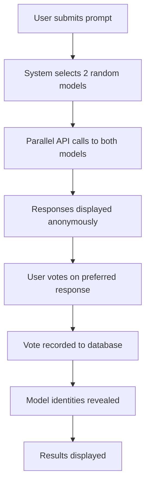
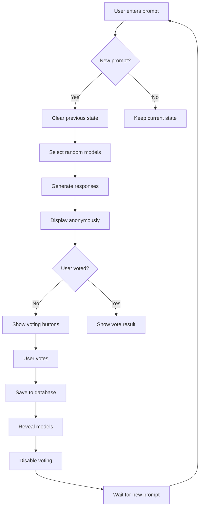

# 🎯 Features Documentation

## 🏟️ Arena Battle System

### Anonymous Comparison

- **Random Model Selection**: Two models are randomly selected from the available pool for each comparison
- **Identity Concealment**: Model identities are completely hidden during the evaluation phase
- **Neutral Labeling**: Users see only "Model A" and "Model B" labels to prevent bias
- **Fair Pairing**: System ensures no model is paired with itself

### Blind Evaluation Process



#### The Process

1. **Prompt Submission**: User enters their question or request
2. **Model Selection**: System randomly selects two different models from the available pool
3. **Parallel Generation**: Both models generate responses simultaneously for fair comparison
4. **Anonymous Display**: Responses are displayed side-by-side with neutral "Model A" and "Model B" labels
5. **User Evaluation**: User votes on their preferred response based solely on quality
6. **Vote Recording**: User's choice is permanently stored in the database
7. **Identity Revelation**: Model names are revealed after voting (planned feature)

### Real-time Response Generation

#### API Integration Features

- **Live API Calls**: Direct integration with RCAC GenAI Studio
- **Streaming Disabled**: Consistent comparison experience without streaming bias
- **Concurrent Requests**: Parallel API calls for faster response times
- **Comprehensive Error Handling**: Graceful handling of failed API calls
- **Rate Limiting Protection**: Intelligent management of API usage limits

## 🗳️ Voting System

### Vote Options

| Option               | Description                        | Use Case                          |
|----------------------|------------------------------------|-----------------------------------|
| 👈 **A is better** | Model A provided superior response | Clear preference for left response |
| 👉 **B is better** | Model B provided superior response | Clear preference for right response |
| 🤝 **Tie** | Both responses are equally good | Similar quality responses |
| 👎 **Both are bad** | Neither response is satisfactory | Poor quality from both models |

### Voting Rules

- **One Vote Per Prompt**: Users can only vote once per prompt
- **Vote Validation**: Buttons are disabled after voting
- **Immediate Feedback**: Vote confirmation displayed instantly
- **Persistent Storage**: All votes saved to MongoDB
- - **Session-based Tracking**: Votes tracked per browser session
- **IP-based Deduplication**: Prevents multiple votes from same IP (planned)
- **Vote Integrity**: Cryptographic hashing ensures vote authenticity

### Vote Persistence

```python
vote_data = {
    "timestamp": datetime.utcnow(),
    "prompt": user_prompt,
    "model_a": model_a_name,
    "model_b": model_b_name,
    "vote": user_choice  # "A", "B", "Tie", or "Both are bad"
}
```

## 🎨 User Interface

### Layout Structure

#### Header Section

- Application title and branding
- Navigation elements
- Status indicators

#### Input Section

```python
prompt = st.text_area(
    "Enter your prompt:",
    height=100,
    placeholder="Ask anything you'd like to compare between models..."
)
```

#### Response Display

- **Two-Column Layout**: Side-by-side comparison
- **Model Labels**: Anonymous "Model A" and "Model B"
- **Response Formatting**: Markdown rendering support
- **Loading States**: Spinners during API calls

#### Voting Interface

```python
col1, col2, col3, col4 = st.columns(4)

with col1:
    if st.button("👈 A is better", disabled=has_voted):
        record_vote("A")

with col2:
    if st.button("👉 B is better", disabled=has_voted):
        record_vote("B")

with col3:
    if st.button("🤝 Tie", disabled=has_voted):
        record_vote("Tie")

with col4:
    if st.button("👎 Both are bad", disabled=has_voted):
        record_vote("Both Bad")
```

## 🔄 User Experience Flow

### Step-by-Step Process

1. **Initial Load**
   - Application loads with empty prompt field
   - Session state initialized
   - Database connection established

2. **Prompt Entry**
   - User enters question or prompt in text area
   - Input validation performed
   - System detects new prompt vs. existing prompt

3. **Model Selection**

   ```python
   # Automatic random selection
   available_models = get_available_models()
   model_a, model_b = random.sample(available_models, 2)
   
   # Store in session state
   st.session_state.model_a = model_a
   st.session_state.model_b = model_b
   ```

4. **Response Generation**
   - Simultaneous API calls to both selected models
   - Loading spinners displayed for each response
   - Error handling for failed requests
   - Responses stored in session state

5. **Anonymous Display**
   - Responses shown as "Model A" and "Model B"
   - Side-by-side comparison layout
   - Markdown formatting applied
   - Model identities hidden

6. **Voting Phase**
   - Four voting buttons enabled
   - User selects preferred response
   - Buttons immediately disabled after vote
   - Vote data prepared for storage

7. **Vote Recording**

   ```python
   vote_data = {
       "timestamp": datetime.utcnow(),
       "prompt": st.session_state.current_prompt,
       "model_a": st.session_state.model_a,
       "model_b": st.session_state.model_b,
       "vote": selected_vote
   }
   save_vote_to_database(vote_data)
   ```

8. **Feedback & Reveal**
   - Vote confirmation message displayed
   - Model identities revealed
   - Success/error status shown
   - Session marked as voted

9. **Next Round Preparation**
   - New prompt required for next comparison
   - Previous responses cleared on prompt change
   - Vote status reset for new prompt
   - Fresh model selection for new battle

### State Management Flow



### Error Handling in UX

#### API Failures

- **Timeout**: "Model is taking too long to respond. Please try again."
- **Rate Limited**: "Model is currently busy. Please wait a moment."
- **Invalid Response**: "Model returned an invalid response. Trying again..."

#### Database Issues

- **Connection Failed**: "Unable to save vote. Please check your connection."
- **Save Error**: "Vote could not be recorded. Please try again."

#### User Input Validation

- **Empty Prompt**: "Please enter a prompt before generating responses."
- **Too Long**: "Prompt is too long. Please keep it under 1000 characters."

### Accessibility Features

#### Keyboard Navigation

- Tab order through interface elements
- Enter key submits prompts
- Arrow keys navigate voting buttons

#### Screen Reader Support

- Descriptive button labels
- Status announcements for vote results
- Loading state descriptions

#### Visual Indicators

- Clear loading states with spinners
- Icon-coded vote buttons
- Success/error message styling
- Disabled state visual feedback

### Performance Optimizations

#### Response Caching

```python
@st.cache_data(ttl=3600)  # Cache for 1 hour
def get_cached_response(model, prompt):
    """Cache responses for identical prompts"""
    return generate_model_response(model, prompt)
```

#### Lazy Loading

- Responses generated only when needed
- Database connections pooled
- Session state minimized
- Unused components not rendered

#### Progress Indicators

- Real-time API call status
- Response generation progress
- Vote saving confirmation
- Model loading states
